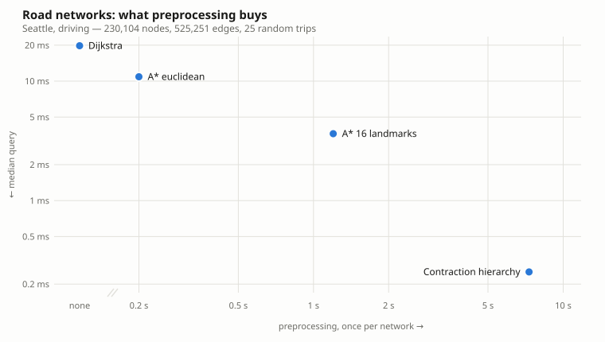
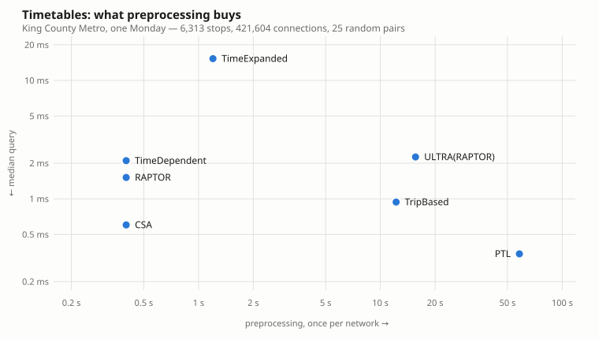
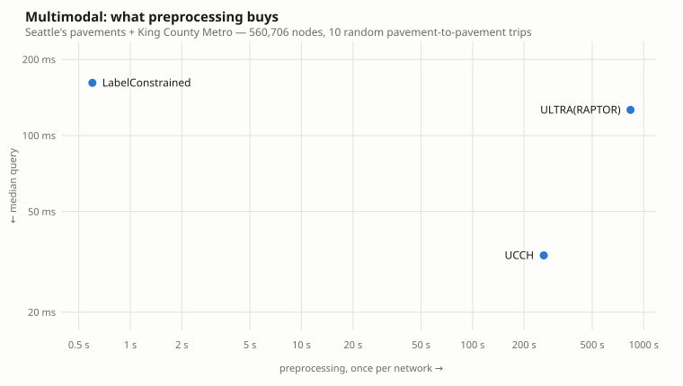

# What preprocessing buys

Every technique on this shelf answers the same question. What separates them is
*when* they spend: some do nothing until asked and then search hard, others
spend minutes rewriting the network so that a query barely searches at all.

These are the two axes. **Preprocessing** is paid once per network, at `bind`.
**Query** is paid once per question, and is the median over a set of random
trips. Both are logarithmic, because the classes span four orders of magnitude
in each direction, and a linear axis would put half the shelf on top of the
origin.

**Down and to the left is better.** A point down and left of another is faster
in both senses, and the technique it beats is *dominated* — which does happen,
and is worth naming when it does. The corner nobody occupies is the bottom
left: a fast query with no preprocessing. That empty space is the whole subject
of the literature these pages describe.

Every row within a chart comes from one run on one instance, and each benchmark
checks that all of its techniques return the same answers before it reports a
time — a row that got faster by getting a different answer fails the benchmark
rather than appearing here.

## Road networks



| technique | preprocessing | memory | settled | median query |
|---|---:|---:|---:|---:|
| [Dijkstra](papers/dijkstra.md) | none | — | 115,698 | 19.777 ms |
| [A* euclidean](papers/astar.md) | 0.2 s | 4 MB | 55,250 | 10.887 ms |
| [A* 16 landmarks](papers/landmarks.md) | 1.2 s | 29 MB | 9,370 | 3.629 ms |
| [Contraction hierarchy](papers/contraction-hierarchies.md) | 7.3 s | 17 MB | 247 | 0.253 ms |

A clean frontier, and the tidiest result on this page: each step costs more
preprocessing than the last and returns a faster query, in the order the
literature produced them. Nothing here is dominated.

Dijkstra sits in the "none" slot at the left rather than at zero, because a log
axis has no zero and pretending its preprocessing is very small rather than
absent would be a quiet lie about a real difference in kind — it has no
preprocessing step at all.

The span is the thing to look at: seven seconds of contraction buys a query
**78× faster** than the one it started from. The settled column says why — 247
nodes touched instead of 115,698, on a network of 230,104.

## Timetables



| technique | preprocessing | memory | settled | median query |
|---|---:|---:|---:|---:|
| [TimeDependent](papers/pyrga.md) | 0.4 s | 11 MB | 3,256 stops | 2.099 ms |
| [TimeExpanded](papers/pyrga.md) | 1.2 s | 150 MB | 66,447 events | 15.264 ms |
| [RAPTOR](papers/raptor.md) | 0.4 s | 16 MB | 4,126 stops | 1.515 ms |
| [CSA](papers/csa.md) | 0.4 s | 25 MB | 3,411 stops | 0.602 ms |
| [TripBased](papers/trip-based.md) | 12.2 s | 28 MB | 8,455 trips | 0.940 ms |
| [PTL](papers/ptl.md) | 58.1 s | 1,165 MB | 12,973 hubs | 0.343 ms |
| [ULTRA(RAPTOR)](papers/ultra.md) | 15.6 s | 15 MB | 6,184 stops | 2.259 ms |

Not a frontier — a scatter, and the interesting one on this page.

**TimeExpanded is dominated outright.** It costs three times TimeDependent's
preprocessing, a hundred and fifty megabytes against eleven, and answers seven
times slower. That is not a failure of the implementation; it is the paper's own
trade, stated honestly. A node per event turns the timetable into an ordinary
graph that any stock shortest-path search can route — and on a city's weekday
that means 837,924 nodes, which is what a query then has to search. You buy
simplicity and generality, and pay in size.

**CSA is the surprise.** It spends the same 0.4 s the graph models spend and
answers faster than TripBased, which spent twelve seconds precomputing
transfers. Sorting 421,604 connections into one array and scanning them turns
out to be extremely hard to beat on a city-sized instance — "intriguingly
simple", as the title has it.

**PTL is at the far corner, and its axis is the wrong one.** Its query is the
fastest here, but the number that decides whether you can use it is not on this
chart: 1,165 MB, against 11–28 MB for everything else. The scatter shows time
against time; on memory PTL is forty times its nearest neighbour.

**ULTRA is not comparable, and is drawn anyway.** It appears here because it
was measured in the same run, but it is solving a harder problem than the rows
around it: unlimited walking transfers rather than transfers within a fixed
radius. Read it as the cost of a capability, not as a slower RAPTOR — the
comparison it belongs in is the multimodal one below. Its walking network here
is the feed's own footpaths, 21,020 edges, which is small enough that the
Bucket-CH its query uses costs a little more than the plain search it replaced;
the structure earns its keep on a city's pavement, which is the next chart.

## Multimodal



| technique | preprocessing | memory | median query |
|---|---:|---:|---:|
| [LabelConstrained](papers/label-constrained.md) | 0.6 s | 14 MB | 161.551 ms |
| [UCCH](papers/ucch.md) | 260.7 s | 66 MB | 33.554 ms |
| [ULTRA(RAPTOR)](papers/ultra.md) | 836.9 s | 374 MB | 126.301 ms |

A harder instance than the two above: 560,706 nodes of pavement and timetable
joined by link arcs, and every trip starts and ends on the street rather than
at a stop. All three return the same arrivals on all ten trips.

**UCCH does what it claims.** Four and a half minutes of contracting the
pavement buys a query **4.8× faster** than searching the whole network — better
than the ~3.5× the [UCCH page](papers/ucch.md) quotes, and, as that page says,
near this technique's ceiling: what remains is the transit search inside the
core, which UCCH does not touch.

**ULTRA is still behind UCCH here, and the reason has moved.** It used to be
that ULTRA's query ran two unbounded Dijkstras over the whole street graph,
which cost 849 ms. That was this implementation's shortcoming rather than the
paper's: §4.1 answers the walks at either end with **Bucket-CH**, and it is
now implemented, which took the query to 126 ms. Where the remaining time goes,
measured phase by phase on one binding:

| phase | median |
|---|---:|
| Bucket-CH: the direct walk and both transfer sets | 8.0 ms |
| the wrapped RAPTOR | 164.1 ms |
| reading the best place to get off | 5.2 ms |

(A separate run from the table above, so the totals differ by the usual
machine-to-machine slack; the proportions are the point.)

The query is now dominated by the technique ULTRA wraps, and the reason is
visible in the paper's own pruning rule. An initial transfer is worth keeping
only if it beats *walking the whole way* — and on a trip across Seattle,
walking the whole way takes between three and nine hours. Almost every stop in
the city beats that, so RAPTOR is seeded with two to five thousand of them
rather than a handful. The paper says as much: the pruning "drastically
improves local queries", and the one genuinely local trip in the sample, whose
direct walk is 44 minutes, has 104 initial transfers rather than 5,166.

So ULTRA's cost here is the cost of the capability, honestly measured: walking
without a radius means thousands of stops really are reachable on foot, and
something has to route from all of them. What it is *not* any more is two
half-million-vertex Dijkstras per query.

The preprocessing went the other way — 617 s to 837 s, and 239 MB to 374 MB —
because Bucket-CH is a third preprocessing step, a full contraction of the
street graph plus 9.0 million bucket entries. That is the trade the paper
describes, and it is why this row sits where it does rather than at the bottom
of the chart.

## Reproducing these

Each chart is one command, and every number on this page came from these three
on one machine — an Intel Core i9-8950HK, macOS 15.7.4, routelab 0.1.0:

```bash
python benchmarks/bench_contraction.py data/Seattle.osm.pbf --trips 25
python benchmarks/bench_transit.py data/kcm.zip --date 2026-08-17 --pairs 25
python benchmarks/bench_multimodal.py data/Seattle.osm.pbf data/kcm.zip \
    --date 2026-08-17 --pairs 10
```

The extracts are not in the repository — `data/` is ignored, and everyone
fetches their own from [Geofabrik](https://download.geofabrik.de) or
[BBBike](https://download.bbbike.org/osm/bbbike/) and their own feed.

**The shape is the point, not the absolute values.** Another machine will move
every point by some constant factor, which on a log axis slides the whole cloud
without changing what it says. What would change the shape is a different
network: a smaller city compresses the preprocessing axis, and a feed with
denser service moves the timetable techniques relative to each other. The
numbers live in [`docs/measurements.json`](measurements.json) with the commands
that produced them; [`docs/plot.py`](plot.py) redraws the charts from it.

## See also

- [The shelf](index.md) — every paper implemented here, with a page each.
- `benchmarks/` — the scripts, which check agreement before they report a time.
